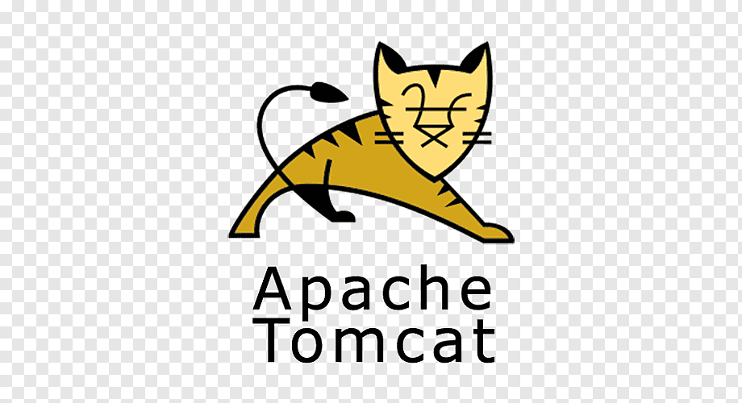

# 📽️ Cinema 🎞️

Cinema-app is a REST web application that allows users to book movie tickets at a cinema. 
The application implements basic functions such as viewing available movies, adding tickets to the cart, 
creating an order based on the added tickets, searching for available movie shows by date, etc. In addition, 
it has separate features for administrators that allow you to manage movie theaters, movies, and movie sessions, 
as well as search for users by email address.

## Table of Contents

[Detailed description of functionality](#Detailed-description-of-functionality)

[Endpoints](#endpoints)

[Project Structure](#project-structure)

[Technologies Used](#technologies-used)

[Instructions for Launching the Project](#instructions-for-launching-the-project)

## 🔥Detailed description of functionality

#### User functionality:🤖

- Registering, logging in, and logging out of your account.
- View a list of movie theaters, available movies and movie sessions.
- Adding tickets to the cart and creating an order based on the added tickets.
- Review and fulfillment of ticket orders.
- Buying tickets for movie screenings.
- View and update your ticket basket.

#### Administrator functions:

- Add, update, and delete theaters, movies, and screenings.
- Search users by email address.

## ✅󠁩󠁤󠁪󠁷󠁿Endpoints

The Cinema-app provides the following endpoints:

#### User and Admin Endpoints:

- POST: /register - User registration.
- GET: /cinema-halls - View cinema halls.
- GET: /movies - View movies.
- GET: /movie-sessions/available - View available movie sessions.

#### Admin-only Endpoints:

- POST: /cinema-halls - Add a new cinema hall.
- POST: /movies - Add a new movie.
- POST: /movie-sessions - Add a new movie session.
- PUT: /movie-sessions/{id} - Update a movie session.
- DELETE: /movie-sessions/{id} - Delete a movie session.
- GET: /users/by-email - Find a user by their email address.

#### User-only Endpoints:

- GET: /orders - View user's orders.
- POST: /orders/complete - Complete an order.
- PUT: /shopping-carts/movie-sessions - Update the shopping cart with movie sessions.
- GET: /shopping-carts/by-user - View the shopping cart for a specific user.

## ⚡Project structure

## 📚Technologies used:📖

- Java 17  
- Tomcat 9.0.75  
- MySQL 8.0.22  
- Maven 3.1.1  
- Java Servlet 4.0.1
- Spring 5.3.20 🍃
- Spring-Web 5.3.20
- Spring-Security 5.6.10
- Hibernate 5.6.14.Final  
- JDBC

## ⚙️Instructions for launching the project

1. Download the code from the project repository to your local computer.
2. Start the MySQL server and create a database named "cinema_app".
3. In the [db.properties](src/main/resources/db.properties) file (usually located in src/main/resources), 
   configure database connection options such as URL, username, and password.
4. Start Maven to build the project and generate the WAR file.
5. Extract the WAR file and copy it to the "webapps" directory of your Tomcat server.
6. Start the Tomcat server.
7. Open a web browser and navigate to http://localhost:{PORT}/CinemaApp/ where {PORT} is the port your Tomcat server is running on.
8. Cinema-app should now be available for use in your browser at http://localhost:{PORT}/CinemaApp/.
